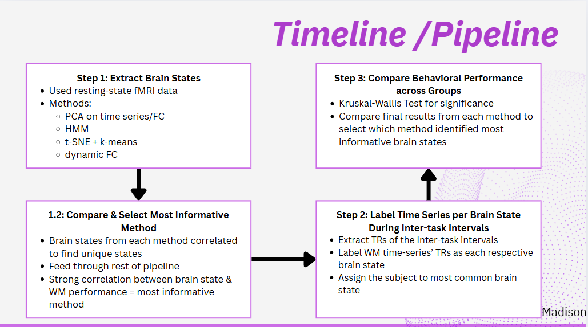
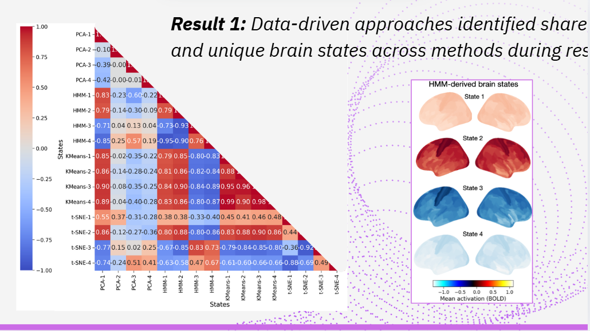
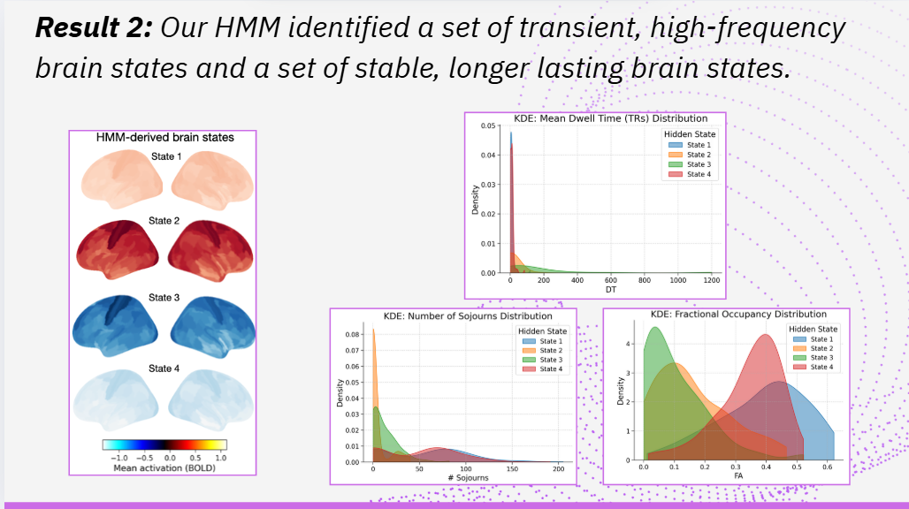
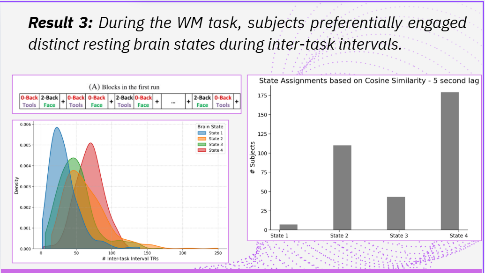
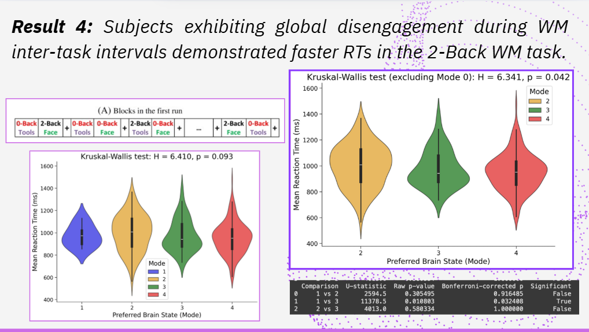

# Resting-Brain-States-WM-Performance – Neuromatch Academy 2025 Project  

**Title:** Engagement of Personalized Resting-State and Task-Activated Brain States During Inter-Task Intervals Predicts Working Memory Task Performance in Healthy Adults  

This repository documents our project for the **Neuromatch Computational Neuroscience Academy (NMA 2025)**. The project began as a **proposal and exploratory analysis** to test whether dynamic brain states during inter-task intervals relate to working memory performance using the **Human Connectome Project (HCP 2020) dataset**.  

---

## 📌 Overview  

Functional neuroimaging studies often average brain activity across long windows, which obscures rapid changes in **whole-brain functional connectivity**. Prior research has shown that:  
- Individuals transition between **rest-like brain states** during task inter-block intervals (Fair et al., 2007).  
- Canonical brain states exist during rest, including **sensorimotor–association gradients** and recurring activation states (Margulies et al., 2016).  

Our project asks:  
👉 *Do individuals preferentially engage certain rest-like or task-like brain states during inter-task intervals? And does this engagement predict their working memory (WM) task performance (accuracy, reaction time)?*  

---

## 🎯 Hypothesis  

- **H1:** Subjects whose inter-task brain states resemble canonical *rest states* will perform better (higher accuracy, faster reaction times).  
- **H2 (alternative):** Subjects whose inter-task brain states resemble *task-activated states* will perform better, suggesting anticipatory engagement.  

---

## 🧠 Methods  

### Dataset  
- **Human Connectome Project (HCP 2020)** – 339 unrelated healthy adults.  
- Resting-state + Working Memory task fMRI.  
- Preprocessing: standard HCP pipeline, cortical parcellation (360 regions).  

### Approach  
1. **Brain State Identification**  
   - Extract sliding-window connectivity matrices.  
   - Apply dimensionality reduction (PCA, t-SNE).  
   - Cluster states with **k-means** and **HMM**.  

2. **Inter-Task Interval Analysis**  
   - Extract timepoints between task blocks.  
   - Assign states to each subject via correlation to canonical states.  
   - Compute dwell time, entropy, transition probabilities.  

3. **Behavioral Modeling**  
   - Relate dwell time & transitions to WM performance (2-back accuracy & RT).  
   - Test with linear models (GLMs, LASSO) and exploratory ML (SVM, RNNs).  

---

## 📂 Repository Structure  
```
InterstateMindways-NMA2025/
│
├── README.md                      <- this file
│
├── proposal/                      <- drafts and project design
│   ├── InterstateMindways_FinalPres.pptx
│   └── Project_Proposal.docx
│
├── data/
│   └── README.md                  <- notes on accessing HCP data via NMA
│
├── notebooks/                     <- Jupyter notebooks
│   ├── 00_starter_notebook.ipynb  <- provided by NMA (data loading/exploration)
│   ├── hmm_analysis.ipynb
│   ├── kmeans_analysis.ipynb
│   ├── tsne_analysis.ipynb
│   ├── pca_analysis.ipynb
│   └── comparison.ipynb           <- integrates outputs across methods
│
├── results/
│   ├── csv/                       <- outputs of each method
│   │   ├── hmm_results.csv
│   │   ├── kmeans_results.csv
│   │   ├── tsne_results.csv
│   │   └── pca_results.csv
│   ├── figures/                   <- visualizations (brain states, plots, heatmaps)
│   │   ├── Avg _Activity_Across Networks_hmm.png
│   │   ├── hmm_1.png
│   │   ├── hmm_2.png
│   │   ├── hmm_3.png
│   │   └── hmm_derived_brain_states.png
│   │   ├── k-means_on_dfc_results.png
│   │   ├── pca_results.png
│   │   └── pipeline_diagram.png
│   ├── result_1.png       
|   ├── result_2.png
|   ├── result_3.png
|   ├── result_4.png     
│   └── corr_between_methods.png        
│   
├── requirements.txt               <- Python dependencies
└── LICENSE
```


---

## 🚀 Run the Notebooks  

Each notebook can be opened directly in **Google Colab**:  

- Starter Notebook (Neuromatch data loading)  
  [](https://colab.research.google.com/github/moelnefary/Resting-Brain-States-WM-Performance/blob/main/notebooks/load_hcp.ipynb)  

- PCA Analysis  
  [](https://colab.research.google.com/github/moelnefary/Resting-Brain-States-WM-Performance/blob/main/notebooks/pca_analysis.ipynb)  

- K-Means Analysis  
  [](https://colab.research.google.com/github/moelnefary/Resting-Brain-States-WM-Performance/blob/main/notebooks/kmeans_analysis.ipynb)  

- HMM Analysis  
  [](https://colab.research.google.com/github/moelnefary/Resting-Brain-States-WM-Performance/blob/main/notebooks/hmm_analysis.ipynb)  

- t-SNE Analysis  
  [](https://colab.research.google.com/github/moelnefary/Resting-Brain-States-WM-Performance/blob/main/notebooks/tsne_analysis.ipynb)  


---

## 📊 Results & Visuals  

### 🧩 Pipeline


### 🔍 Result_1


### 🔍 Result_2
 

### 🔍 Result_3


### 🔍 Result_4



## 🔑 Key Findings (Preliminary)  

- **HMM** revealed both transient and stable brain states.  
- **K-means** identified distinct clusters, though with less temporal resolution.  
- During WM tasks, subjects engaged **rest-like states** during inter-task intervals.  
- Subjects who **globally disengaged** during inter-task intervals had **faster RTs**.  

---

## 🚧 Limitations & Future Directions  

- Analyses ran on ~100 subjects due to computational constraints.  
- TR alignment with block onsets needs refinement.  
- Need to expand across all HCP subjects.  
- Compare resting vs. task brain states in more depth.  

---

## 🙌 Acknowledgments  

- This project was completed as part of **Neuromatch Academy 2025 (Computational Neuroscience track)**.  
##  Team Interstate Mindways  

| Name               | Institution / Affiliation                           |
|--------------------|-----------------------------------------------------|
| Amber Howell       | Rutgers University, New Brunswick, NJ              |
| Lucas Wozniak      | Stanford University, Palo Alto, CA                 |
| Madison Jiang      | University of Texas at Dallas, Dallas, TX          |
| Marina Lemus Pérez | National Autonomous University of Mexico, Mexico   |
| Mohamed Elnefary   | Cairo University, Giza, Egypt                      |
| Muzna Mehmood      | NUST, Islamabad, Pakistan                          |
| Pragata Ghosh      | AIIMS, New Delhi, India                            |
| Sachpreet Singh    | Government Medical College, Patiala, India         |
| Sara Garza Gonzalez| Georgetown University, Washington, DC              |
 

---

  

---

## 📖 References  

- Fair DA, Schlaggar BL, Cohen AL, et al. (2007). *A method for using blocked and event-related fMRI data to study "resting state" functional connectivity.* Neuroimage, 35(1):396–405.  
- Margulies DS, Ghosh SS, Goulas A, et al. (2016). *Situating the default-mode network along a principal gradient of macroscale cortical organization.* PNAS, 113(44):12574–12579.  

---

✨ *“Maybe the answer lies not in how hard we try, but in how the brain quietly tunes itself in the in-between …”*  
